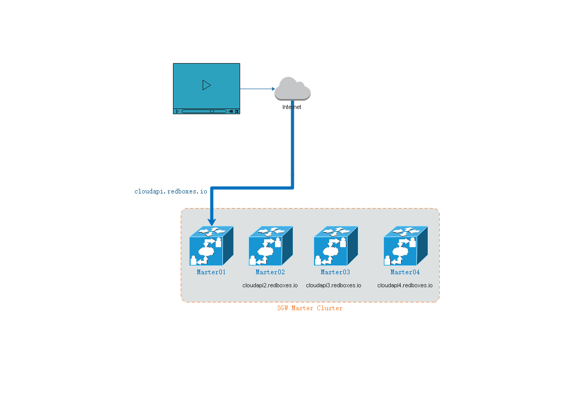
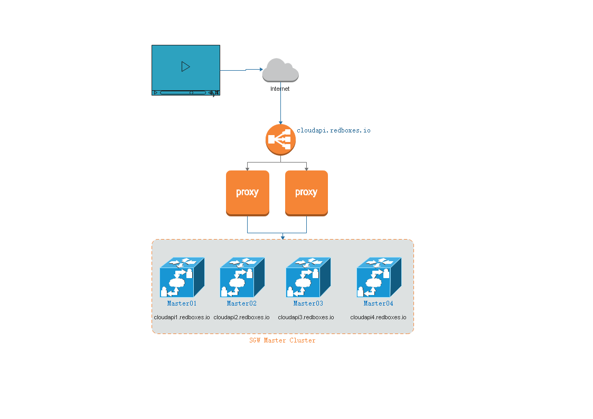

# 现状

SGW master当前四台主机，对应域名：

域名 | 主机 
---|---
cloudapi.redboxes.io | master01 
cloudapi2.redboxes.io | master02
cloudapi3.redboxes.io | master03
cloudapi4.redboxes.io | master04


#### 问题
当前播放器并未对四台master做随机选择，而是都会先到cloudapi.redboxes.io请求。

所以如果对应的master01故障，SGW Master就无法正常工作，导致无法播放。


#### 使用情况图示




# 单点故障应对方案

根据当前使用情况，打算用以下方案解决：

1. 购买一台ELB

2. 购买部署两个proxy，转发请求到master01/02/03/04

> proxy参考配置 cpu：2核 内存：4G 带宽：5G

3. 验证部署服务器功能是否正常

4. 新增域名cloudapi1.redboxes.io，指向mastar01

5. **修改master01配置，把对应的"serverIp": "cloudapi.redboxes.io:2095" 修改为"serverIp": "cloudapi1.redboxes.io:2095（需要备份配置）"**

6. **把当前cloudapi.redboxes.io解析到ELB**
7. **mrt server的stream-server-alias.json修改master01对应域名**

其中，5 6两步需要确认前面部署已经能正常工作后才能进行

#### 新的域名对照表
域名 | 主机 
---|---
cloudapi.redboxes.io | ELB
cloudapi1.redboxes.io | master01
cloudapi2.redboxes.io | master02
cloudapi3.redboxes.io | master03
cloudapi4.redboxes.io | master04

#### 方案图示




#### 回滚方案

回滚只需要回复备份配置即可，即
"serverIp": "cloudapi1.redboxes.io:2095" 改回 "serverIp": "cloudapi.redboxes.io:2095"

# 参考

#### SGW master工作逻辑
```sequence
Client -> SGW_Marster01: GET playUrl
Note right of SGW_Marster01: 选择合适SGW_Marster
Note right of SGW_Marster01: 非本机则301一次
SGW_Marster01 --> Client:  playUrl@SGW_MarsterX
Client -> SGW_MarsterX: GET playUrl
SGW_MarsterX --> Client:  mpsUrl@SGW_MarsterX
Note right of SGW_Marster01: 本机
SGW_Marster01 --> Client:  mpsUrl@SGW_Marster01
Note left of Client: 假设分配到SGW_MarsterY
Client -> SGW_MarsterY: GET mps
Note right of SGW_MarsterY: select mrt server
SGW_MarsterY --> Client:  mps (mrt)
```